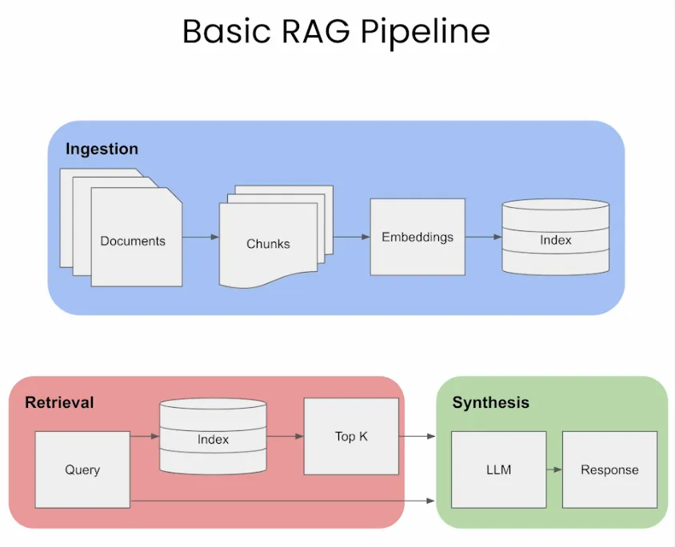

# fancy-rag
## Retrieval Augmented Generation using LangChain and Chainlit



This repository contains a Chainlit application that provides a question-answering service using documents stored in a Chroma vector store. It allows users to upload plain text or pdf files, which are then chunked, embedded, and indexed for efficient retrieval. When a user asks a question, the application retrieves relevant document chunks and uses OpenAI's language model to generate an answer, citing the sources it used.

### Prerequisites

- Python 3.11 or higher
- Chainlit installed
- text/pdf files to be indexed

### Setup and Run

1. **Install Dependencies:**

Install the required Python packages specified in `requirements.txt`.

```shell
pip install -r requirements.txt
```

2. **Set up Application:**

* Create a `.env` file with your `OPENAI_API_KEY`.

3. **Run the Application:**

   for text files:
   ```shell
   chainlit run rag_txt.py 
   ```

   for pdf files:
   ```shell
   chainlit run rag_pdf.py 
   ```


4. Access the application at `http://localhost:8000`.
